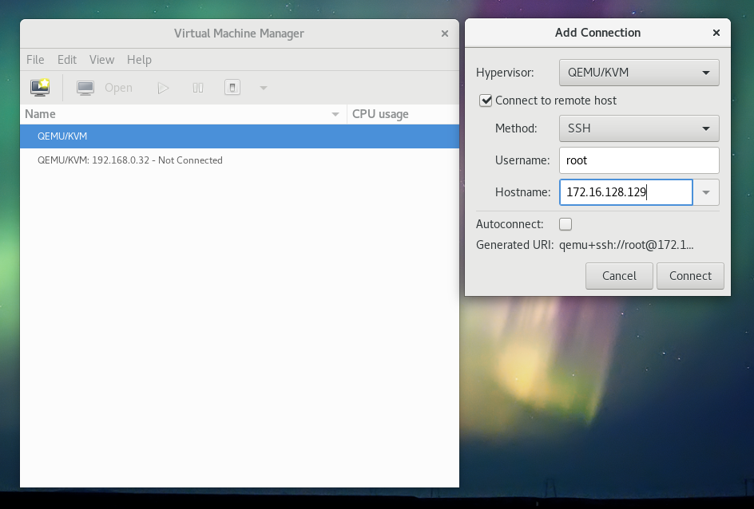

# Stappenplan installatie servers

## Inleiding

Deze documentatie bevat alle stappen om __from scratch__ het netwerk op te zetten. Gezien voor de release de virtualisatieservers reeds op voorhand worden klaargezet, zijn op dat moment enkel de secties __Aanmaken VMs (met script)__ en __Servers instellen__ noodzakelijk.

## CentOS installeren

- Zorg ervoor dat de PC verbonden is met het klasnetwerk
- Start de PC
- Ga naar het BIOS en controleer dat PXEBoot geactiveerd is en voor de harde schijf staat in de opstartvolgorde
- Herstart en start op via PXE
- Selecteer CentOS installeren
- Selecteer de gewenste taal en klik op `Continue`
- Klik op `Keyboard`, de azerty-layout toe en klik op `Done`
- Klik op `Date & time`, selecteer `Europe` en `Brussels` en klik op `Done`
- Klik op `Software selection`, selecteer `Virtualization host` en klik op `Done`
- Klik op `Network`, selecteer `Ethernet`, klik op `On` en dan op `Done`
- Klik op `Begin installation`
- Klik op `Password`, stel het wachtwoord `password` in en klik op `Done`
- Als de installatie klaar is klik je op `Reboot`

## Configuratie KVM

- Login met gebruikersnaam `root` en wachtwoord `password`
- Activeer IP forwarding met volgende commando's:
  ```shell
  $ echo "net.ipv4.ip_forward = 1" > /etc/sysctl.d/99-ipforward.conf
  $ sysctl -p /etc/sysctl.d/99-ipforward.conf
  net.ipv4.ip_forward = 1
  ```
- Configureer de bridge interface.
  - Ga naar de map `/etc/sysconfig/network-scripts/` met `cd /etc/sysconfig/network-scripts/`
  - Pas het script van de ethernet interface als volgt aan met `vi ifcfg-{interface}`:
    ```
    TYPE=Ethernet
    ONBOOT=yes
    BRIDGE=virbr0
    ```
  - Maak een nieuw script voor de bridge interface met `vi ifcfg-virbr0` en plaats er het volgende in:
    ```
    TYPE=Bridge
    BOOTPROTO=static
    DEVICE=virbr0
    ONBOOT=yes
    IPADDR={ip adres van de host}
    NETMASK={netmask van de host}
    GATEWAY={gateway van de host}
    DNS=8.8.8.8
    ```
  - Verbind de pc met het netwerk van de opstelling
  - Herstart de `network` service met `systemctl restart network`
  - Controleer of de bridge interface geactiveerd is met `ip a show virbr0`
  - Controleer of er internettoegang is met `ping 8.8.8.8`
- Installeer ```virt-install```:
  ```shell
  $ yum install virt-install -y
  ```

## Aanmaken VMs

### Met script

#### Omschrijving script

Er is een script voorzien (`scripts/create-vms.py`) dat het aanmaken en de initiële setup van de servers automatiseert.

Dit script neemt als input een YAML-file waarin een lijst van serverconfiguraties zijn gedefinieerd. De syntax van zo'n file is als volgt:

```yaml
- hostname: alfa1
  ip: 172.16.128.132
  network: 172.16.128.128
  netmask: 255.255.255.128
  broadcast: 172.16.128.255
  gateway: 172.16.128.129
  mem: 512
  vcpu: 1

- hostname: bravo1
  ...
```

De betekenis van de verschillende variabelen is als volgt:

| Variabele   | Betekenis                             |
| :---        | :---                                  |
| `hostname`  | De hostname van de virtuele machine   |
| `ip`        | Het IP-adres van de virtuele machine  |
| `network`   | Het netwerk adres van het subnet      |
| `netmask`   | Het netmask van het subnet (decimaal) |
| `broadcast` | Het broadcast adres van het subnet    |
| `gateway`   | De default gateway                    |
| `mem`       | Het RAM-geheugen van de VM in MB      |
| `vcpu`      | Het aantal virtuele cpu's voor de VM  |

Verder accepteert het script nog enkele optionele argumenten:

| Argument     | Standaardwaarde           | Betekenis                                             |
| :---         | :---                      | :---                                                  |
| `-t DIR`     | `/tmp/cloud-init/`        | Tijdelijk map waar de config files worden opgeslagen  |
| `-i DIR`     | `/var/lib/libvirt/images` | Map waar de images naar gekopieerd worden             |
| `-b FILE`    | `%imgdir%/centos.qcow2` | Base image waarvan vertrokken wordt                   |
| `-n NETWORK` | `virbr0`                  | De bridge-interface die de VM moet gebruiken          |

De standaardwaarden voldoen normaal gezien.

Het script maakt gebruik van [cloud-init](http://cloudinit.readthedocs.io/en/latest/) om de initiële configuratie van de VMs te verzorgen. Hiervoor zijn twee templates voorzien (`scripts/templates/user-data` en `scripts/templates/meta-data`) die onder andere het netwerk juist configureren, maar ook SSH public keys toevoegen. Als je wil kunnen inloggen op de server dien je je eigen public key (te vinden in `~/.ssh/id_rsa.pub` op je laptop), zodat je kan inloggen zonder wachtwoord, toe te voegen in `scripts/templates/user-data` in de variabele `ssh_authorized_keys`:

```
users:
  - name: admin
    ...
    ssh_authorized_keys:
      - ssh-rsa AAAAB3NzaC1yc2EAAAADAQABAAABAQDwKAtbGAwZJOmexg3fPGSBIKWS2BRDixoRU9RK0q6wyW/LuUkm31VQnwcytzyXwuyizYaI9oQibXt+epAdRTEn5sVj4X8x+nwhdTBkeXf4QL5fy4jrEBiYQ55wlx8ds4Rw/C3Sama8xJxuauh6xLIlCBTCVyofEHT4lJDE7KOy0skw9Gj0bUNImaD7sD9/E1/0gBBX8f3uK4jEP5qW/Sv6K9ulqMIR8x+ACaLJNopEIHtVFbDBYpL+gBeRep7k7MqcB3lGlW/66F4psTmD2z+EKv9WT5jhn8ftD3+yqQNMNEDD5zF3qoqa37TmKiQWNjVPe2+6gIsNgRNkYQQl6WPT lander@lovelace
      - {plak hier je eigen key}
```

#### Requirements

De voorwaarden die moeten voldaan zijn om het script uit te voeren zijn de volgende:

- Volgende packages zijn geïnstalleerd:
  - `python`
  - `virt-install`
  - `genisoimage`
  Ontbrekende packages kunnen geïnstalleerd worden met `yum install {naam package}`.
- Volgende Python packages zijn geïnstalleerd:
  - `jinja2`
  - `pyyaml`
  Ontbrekende Python packages kunnen geïnstalleerd worden met `pip install {naam package}`.
  Als `pip` niet geïnstalleerd is kan dit geïnstalleerd worden met `easy_install pip`.
- Er is een base image aanwezig. Deze base image kan je downloaden van de CentOS website:
  ```shell
  $ curl -o /var/lib/libvirt/images/centos.qcow2.xz http://cloud.centos.org/centos/7/images/CentOS-7-x86_64-GenericCloud.qcow2.xz
  $ unxz /var/libvirt/libvirt/images/centos.qcow2.xz
  ```
- Er is een YAML file met de serverconfiguraties voorhanden.
  Voor de release zijn er twee sets voorzien:
    - De files in `scripts/servers/test/` plaatsen alle VM's in één groot `/16` subnet.
    - De files in `scripts/servers/release/` plaatsen alle VM's in hun correcte subnet volgens de vastgelegde adressering.

#### Werkwijze

- Log in op de fysieke server (user: `root`, wachtwoord: `password`)
- Zorg ervoor dat alle requirements voldaan zijn (zie vorige sectie)
- Zorg ervoor dat de scripts voorhanden zijn op de fysieke servers:
  ```shell
  $ cd /tmp
  $ git clone https://github.com/HoGentTIN/p3ops-green.git
  $ cd p3ops-green/scripts
  ```
- Check dat KVM draait:
  ```shell
  $ systemctl status libvirtd
  ```
- Voer het script uit met de YAML-file voor de server die je wenst te installeren. Bijvoorbeeld:
  ```shell
  $ python create-vms.py servers/release/virt1.yaml
  ```
- Als het script uitgevoerd is zonder errors zijn de VM's nu klaar voor gebruik en zijn ze bereikbaar via het geconfigureerde IP.
- Er kan nu overgegaan worden tot het uitvoeren van het Ansible playbook (zie verder).
- Indien je publieke SSH-key toegevoegd is aan de configuratie kan je nu inloggen via SSH zonder wachtwoord met de user `admin`.

#### Opmerkingen

- Wanneer gebruik wordt gemaakt van de test-setup voor het uitvoeren van Ansible zal bij het overschakelen naar het echte netwerk de netwerkconfiguratie handmatig moeten worden aangepast. Met name de subnetting komt dan niet overeen.
- Eventueel kan, eens de DNS server in het netwerk draait, de DNS-instelling aangepast worden van 8.8.8.8 naar het IP van de DNS server. Ook dit moet handmatig gebeuren.

### Manueel (niet meer nodig)

- Kopieer de CentOS iso vanaf een usb-stick naar `/tmp/centos.iso`
  - Steek de usb-stick in de PC.
  - Kijk welke naam de usb-stick heeft gekregen met `lsblk`. De partitie heeft een naam gekregen in de vorm van `sdXY` met `X` een letter en `Y` een cijfer.
  - Mount de usb-stick naar `/mnt`:
    ```shell
    $ mount /dev/sdXY /mnt
    ```
  - Kopieer de iso naar `/tmp`:
    ```shell
    $ cp /mnt/{naam van de iso}.iso /tmp/centos.iso
    ```
  - Unmount de usb-stick:
    ```shell
    $ unmount /mnt
    ```
  - Je kan nu de usb-stick veilig verwijderen.
- Maak voor elke server een virtuele machine aan:
  ```
  $ virt-install \
   --name {naam van de server} \
   --ram 1024 \
   --disk /var/lib/libvirt/images/{naam van de server}.img,device=disk,bus=virtio,size=8,sparse=true,format=raw \
   --vcpus 1 \
   --os-type linux \
   --os-variant rhel7 \
   --network bridge=virbr0,model=virtio \
   --vnc \
   --noautoconsole \
   -c /tmp/centos.iso
  ```
- Controleer de vnc-poort voor de VM:
  ```shell
  $ virsh vncdisplay {naam van de server}
  :1
  ```
  Het verkregen getal moet je optellen bij de basispoort 5900 om de echte vnc-poort te bekomen (in dit voorbeeld dus 5901).
- Op je laptop moet je nu een ssh-tunnel opzetten naar de virtualisatiehost om een vnc sessie te kunnen starten:
  ```shell
  $ ssh -L {poort}:127.0.0.1:{poort} -N -f -l root {ip van de virtualisatiehost}
  ```
- Je kan nu een vnc sessie starten op je laptop met het adres `localhost:{poort}
- Doorloop de CentOS installatie
- Configureer op elke server het IP adres:
  - Bewerk het script voor de interface met `vi /etc/sysconfig/network-scripts/ifcfg-{interface}`:
    ```
    TYPE=Ethernet
    BOOTPROTO=static
    DEVICE={interface}
    ONBOOT=yes
    IPADDR={ip adres van de server}
    NETMASK={netmask van de server}
    GATEWAY={gateway van de server}
    DNS=8.8.8.8
    ```
  - Herstart de `network` service:
    ```shell
    $ systemctl restart network
    ```
- Als (bijvoorbeeld na een reboot van de host) de VMs niet draaien kan je ze starten met
  ```shell
  $ virsh start {naam van de server}
  ```

## Servers instellen

- Vooraleer met Ansible te beginnen is het nodig om op de servers eens in te loggen via SSH. Dit komt doordat het inloggen gebeurt met een SSH public key, en de eerste keer wordt de fingerprint van de server toegevoegd aan `~/.ssh/known_hosts` op je laptop. Als dit nog niet gebeurd is kan dit problemen geven met Ansible. Inloggen op de servers kan met:
  ```shell
  $ ssh admin@{ip-adres}
  ```
- Eens alle VMs draaien kan ansible uitgevoerd worden vanop een machine waarop ansible is geïnstalleerd, en die aan hetzelfde netwerk is gekoppeld:
  ```shell
  $ ansible-playbook -i production-inventory -u admin site.yml
  ```
- Eventueel kan ansible worden uitgevoerd op een enkele server of een groep van servers (zie `production-inventory` met volgend commando:
  ```shell
  $ ansible-playbook -i production-inventory -u admin -l {naam van de server of groep} site.yml
  ```

## Management met virt-manager

`virt-manager` is een GUI die kan gebruikt worden om KVM te beheren. Jammer genoeg draait dit enkel onder Linux.

Wanneer je over een Linux-machine beschikt kan je door deze tool te installeren connectie maken met de virtualisatieservers, en met een VirtualBox-achtige interface VM's starten, stoppen, aanmaken, verwijderen en zelfs er op inloggen met een soort remote desktop.

Onder Fedora kan je de tool installeren met `sudo dnf install virt-manager`

Je kan dan een connectie leggen met de server door te klikken op `File > Add connection` en volgende instellingen te gebruiken:
- Hypervisor: QEMU/KVM
- ✔ Connect to remote host
- Username: root
- Hostname: {ip van de virtualisatieserver}



Als je publieke SSH key op de server staat zal geen wachtwoord gevraagd worden. In het andere geval kan je inloggen met wachtwoord `password`. Je kan eventueel je publieke key op de server plaatsen met `ssh-copy-id root@{ip van de server}` en daarna het wachtwoord `password` eenmalig in te geven.

Je kan dan een remote desktop sessie openen door te dubbelklikken op een virtuele machine, en zijn instellingen bekijken of aanpassen door op het knopje in de vorm van een gloeilamp te drukken.
