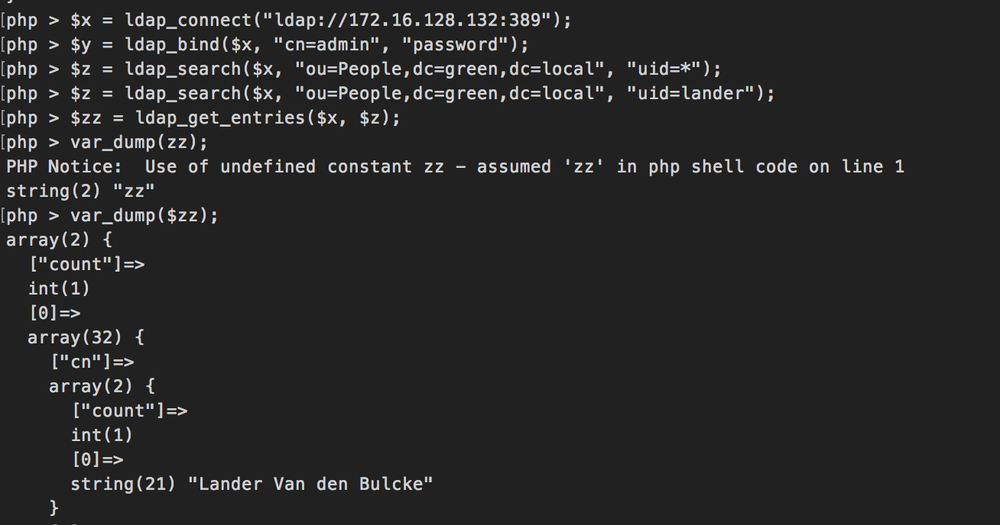

# Troubleshooting rapport connectie Wordpress en LDAP

Auteur: Lander Van den Bulcke

Wanneer `alfa1`, `mike1` en `november1` opgestart zijn is er geen connectie mogelijk met de LDAP server vanuit de wordpress plugin.

- Controleren of er gepingd kan worden van `mike1` naar `alfa1`:
  ```
  [vagrant@mike1 ~]$ ping 172.16.128.132
  PING 172.16.128.132 (172.16.128.132) 56(84) bytes of data.
  64 bytes from 172.16.128.132: icmp_seq=1 ttl=64 time=0.810 ms
  64 bytes from 172.16.128.132: icmp_seq=2 ttl=64 time=0.429 ms
  64 bytes from 172.16.128.132: icmp_seq=3 ttl=64 time=0.370 ms
  ^C
  --- 172.16.128.132 ping statistics ---
  3 packets transmitted, 3 received, 0% packet loss, time 2000ms
  rtt min/avg/max/mdev = 0.370/0.536/0.810/0.195 ms
  ```
    - OK
- Controleer of de firewall op `alfa1` verkeer op poort 389/tcp doorlaat:
  ```
  [vagrant@alfa1 ~]$ sudo firewall-cmd --list-all
  public (active)
    target: default
    icmp-block-inversion: no
    interfaces: enp0s3 enp0s8
    sources: 
    services: ssh dhcpv6-client
    ports: 389/tcp 9830/tcp 636/tcp 3269/tcp
    protocols: 
    masquerade: no
    forward-ports: 
    source-ports: 
    icmp-blocks: 
    rich rules: 
  ```
    - OK
- Controleer of er een service luistert op poort 389/tcp op `alfa1`:
  ```
  [vagrant@alfa1 ~]$ sudo ss -tlnp
  State      Recv-Q Send-Q                                                                          Local Address:Port                                                                                         Peer Address:Port
  LISTEN     0      128                                                                                         *:111                                                                                                     *:*                   users:(("systemd",pid=1,fd=42))
  LISTEN     0      128                                                                                         *:22                                                                                                      *:*                   users:(("sshd",pid=1129,fd=3))
  LISTEN     0      100                                                                                 127.0.0.1:25                                                                                                      *:*                   users:(("master",pid=1304,fd=13))
  LISTEN     0      128                                                                                        :::111                                                                                                    :::*                   users:(("systemd",pid=1,fd=41))
  LISTEN     0      128                                                                                        :::22                                                                                                     :::*                   users:(("sshd",pid=1129,fd=4))
  LISTEN     0      100                                                                                       ::1:25                                                                                                     :::*                   users:(("master",pid=1304,fd=14))
  LISTEN     0      128                                                                                        :::389                                                                                                    :::*                   users:(("ns-slapd",pid=1145,fd=7))
  ```
    - OK
- Controleer of de LDAP service draait op `alfa1`:
  ```
  [vagrant@alfa1 ~]$ sudo systemctl status dirsrv@alfa1
  ● dirsrv@alfa1.service - 389 Directory Server alfa1.
     Loaded: loaded (/usr/lib/systemd/system/dirsrv@.service; enabled; vendor preset: disabled)
     Active: active (running) since zo 2017-12-17 20:20:37 UTC; 1h 9min ago
    Process: 1126 ExecStartPre=/usr/sbin/ds_systemd_ask_password_acl /etc/dirsrv/slapd-%i/dse.ldif (code=exited, status=0/SUCCESS)
   Main PID: 1145 (ns-slapd)
     Status: "slapd started: Ready to process requests"
     CGroup: /system.slice/system-dirsrv.slice/dirsrv@alfa1.service
             └─1145 /usr/sbin/ns-slapd -D /etc/dirsrv/slapd-alfa1 -i /var/run/dirsrv/slapd-alfa1.pid
 
  dec 17 20:20:37 alfa1 ns-slapd[1145]: [17/Dec/2017:20:20:37.093395755 +0000] - INFO - ldbm_instance_config_cachememsize_set - force a minimal value 512000
  dec 17 20:20:37 alfa1 ns-slapd[1145]: [17/Dec/2017:20:20:37.101767002 +0000] - NOTICE - ldbm_back_start - found 1016232k physical memory
  dec 17 20:20:37 alfa1 ns-slapd[1145]: [17/Dec/2017:20:20:37.113037562 +0000] - NOTICE - ldbm_back_start - found 723212k available
  dec 17 20:20:37 alfa1 ns-slapd[1145]: [17/Dec/2017:20:20:37.115557090 +0000] - NOTICE - ldbm_back_start - cache autosizing: db cache: 40649k
  dec 17 20:20:37 alfa1 ns-slapd[1145]: [17/Dec/2017:20:20:37.117107992 +0000] - NOTICE - ldbm_back_start - cache autosizing: userRoot entry cache (2 total): 65536k
  dec 17 20:20:37 alfa1 ns-slapd[1145]: [17/Dec/2017:20:20:37.120638627 +0000] - NOTICE - ldbm_back_start - cache autosizing: NetscapeRoot entry cache (2 total): 65536k
  dec 17 20:20:37 alfa1 ns-slapd[1145]: [17/Dec/2017:20:20:37.132139058 +0000] - NOTICE - ldbm_back_start - total cache size: 201072049 B;
  dec 17 20:20:37 alfa1 ns-slapd[1145]: [17/Dec/2017:20:20:37.148410074 +0000] - NOTICE - dblayer_start - Detected Disorderly Shutdown last time Directory Server was running, recovering database.
  dec 17 20:20:37 alfa1 ns-slapd[1145]: [17/Dec/2017:20:20:37.897868170 +0000] - INFO - slapd_daemon - slapd started.  Listening on All Interfaces port 389 for LDAP requests
  dec 17 20:20:37 alfa1 systemd[1]: Started 389 Directory Server alfa1..
  ```
    - OK
- Controleer of er in de LDAP kan gezocht worden vanop `alfa1`:
  ```
  [vagrant@alfa1 ~]$ ldapsearch -x -b "dc=green,dc=local" -D "cn=admin" -w password
  # extended LDIF
  #
  # LDAPv3
  # base <dc=green,dc=local> with scope subtree
  # filter: (objectclass=*)
  # requesting: ALL
  #

  # green.local
  dn: dc=green,dc=local
  objectClass: top
  objectClass: domain
  dc: green
  
  ...
  ```
    - OK
- Controleer of er in de LDAP kan gezocht worden vanop `mike1`:
  ```
  [vagrant@mike1 ~]$ sudo yum install openldap-clients -y
  [vagrant@mike1 ~]$  ldapsearch -x -b "dc=green,dc=local" -D "cn=admin" -w password -H "ldap://172.16.128.132/"
  # extended LDIF
  #
  # LDAPv3
  # base <dc=green,dc=local> with scope subtree
  # filter: (objectclass=*)
  # requesting: ALL
  #

  # green.local
  dn: dc=green,dc=local
  objectClass: top
  objectClass: domain
  dc: green
  
  ...
  ```
    - OK
- Controleer of de `php-ldap` module is geïnstalleerd op `mike1`
  ```
  [vagrant@mike1 ~]$ sudo yum list installed php-lda
  Fout: Geen passende pakketten om te tonen
  ```
    - Niet OK
    - Installeer door toe te voegen aan `php_packages_extra` in `ansible/host_vars/mike1.yml`
    - Werkt nog steeds niet
- Controleer of er gezocht kan worden in de LDAP server vanuit php:
  
    - OK


Er blijkt connectie te kunnen gemaakt worden vanuit php, maar niet vanuit WordPress. De oorzaak hiervan is tot op heden nog niet gevonden.
